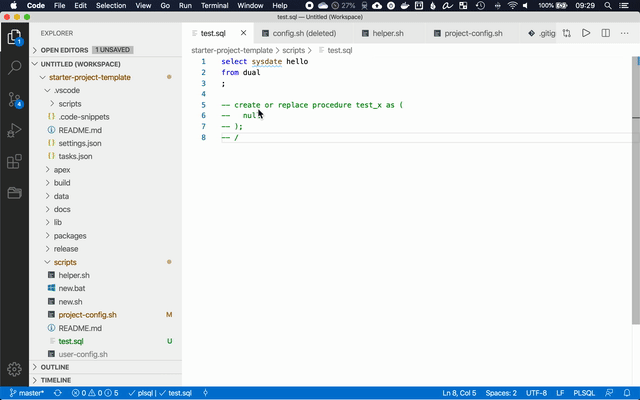

# MS Visual Studio Code Build Tasks

- [Setup](#setup)
  - [`tasks.json`](#tasksjson)
- [Tasks](#tasks)
  - [Compiling Code](#compiling-code)
  - [APEX Export](#apex-export)

[Microsoft Visual Studio Code (VSC)](https://code.visualstudio.com/) is a code editor. It is the recommended editor for Logger. VSC allows for compile PL/SQL code directly from VSC (see [this blog](https://ora-00001.blogspot.ca/2017/03/using-vs-code-for-plsql-development.html)) for more information.

## Setup

The first time you execute this script an error will be shown and `scripts/user-config.sh` will be created with some default values. Modify the variables as necessary.

### `tasks.json`

This file defines the VSCode task. The only thing that needs to be modified is the to define a task name. Search the file for `CHANGEME` and replace with the project name.

## Tasks

Tasks can be executed with `⌘+shift+B` and selecting the desired task.

### Compiling Code

To compile the current file you're editing execute `compile: <project name>` task.

### APEX Export

If you want to export your APEX applications (defined in `scripts/project-config.sh`) execute the `apex export: <project name>`
