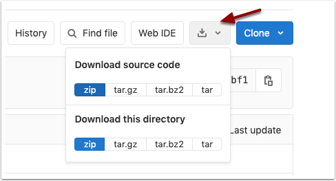

# Starter Project Templates

Use this repo to start a new project. 

You lickely want to download and not clone or fork. Then you can `git init` and start a new repo. 




Follow the steps below to configure and initialize.

# Setup

* Run `cd scripts; sh config.sh` (or `config.bat`)
* Setup `app/_ins.sql` with the correct Workspace & App Number
* Generate for your `release.sql` script [ASCII Art](https://asciiartgen.now.sh/?style=standard)

# Getting Started

Start a new release:
```
sh scripts/new.sh
```
 