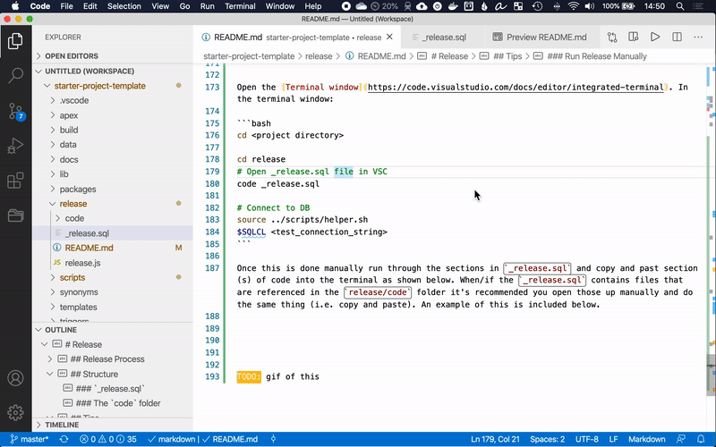

# Release

- [Structure](#structure)
  - [`_release.sql`](#_releasesql)
  - [`all_....sql` files](#all_sql-files)
  - [The `code` folder](#the-code-folder)
- [Release Process](#release-process)
  - [Concept 1: Code is tagged each time it is run in Production](#concept-1-code-is-tagged-each-time-it-is-run-in-production)
  - [Concept 2: Code is tagged each time it leaves Dev](#concept-2-code-is-tagged-each-time-it-leaves-dev)
  - [Running a Release in Production](#running-a-release-in-production)
- [Tips](#tips)
  - [Run Release Manually](#run-release-manually)

This folder contains examples on how to structure release along with various options on **how** to do a release. Before proceeding you should have a [Git workflow](../README.md#git-workflows) as some of the `git` examples may need to be altered to cater towards the chosen workflow.

## Structure

Some files are provided by default to help guide your release process


### `_release.sql` 

Example release script. This is the only file that will be run for each release. Inside `_release.sql` it references other files that are required for the release. By having a single consistent file for each release it helps simplify release scripts if using automated scripting tools.  

You must review this file and modify it accordingly for your project needs. Again, every project is different and it's expected that this file should be modified to meet your project's needs. 

### `all_....sql` files

They're several `all*.sql` files which are described below. All of the files that are flagged as auto generated are generated during the [build](../build) process.

File | Auto Generated | Description
--- | --- | ---
[`all_apex.sql`](all_apex.sql) | Yes | Will install all the APEX applications as defined in [`scripts/project-config.sh`](../scripts/project-config.sh)
[`all_data.sql`](all_data.sql) | No | Runs all the re-runnable data scripts. You must manually add references to this file as order matters
[`all_packages.sql`](all_packages.sql) | Yes | References all the packages in the `packages` folder. By default this will run all the `.pks` files first then the `pkb` files next
[`all_views.sql`](all_views.sql) | Yes | References all the views in the `views` folder
[`load_env_vars.sql`](load_env_vars.sql) | Yes | Loads some of the environment variables, defined in [`scripts/project-config.sh`](../scripts/project-config.sh), into SQL session


### The `code` folder

This folder stores non-rerunable code specific to each release. It's recommended to create a file per-ticket. Ex: `code/issue-123.sql`. The contents of `code/issue-123.sql` may contain things such as DDL and DML statements. Re-runnable code (such as views, packages, etc) **should not** be in here. Instead, store them in their appropriate folders included with this project. After each release the contents of the `code` folder will be deleted as it is no longer required.

Each file created in the `code` should be added to `code/_run_release_code.sql`. This file should be cleared after each release. Examples of what `code/_run_release_code.sql` would look like:

```sql
@issue-123.sql
@issue-456.sql
```


## Release Process

Oracle releases are very "unforgiving" (i.e. if an error occurs it can ruin the entire rest of release and make it difficult to back out). This can make it very difficult to run standard CI/CD tools to dor releases in Oracle as one error can completely corrupt an environment and it may not be easy to "restore" the schema to a point in time before the release. *Note: Making releases scripts re-runnable or providing roll back support is not impossible however it can be very expensive to do so properly.*, 

The rest of this section assumes the following:
- Release process is not re-runnable. For example if a DDL statement fails there's no way to tell if it's already been run.
- There is no rollback script to undo all the changes in a given release
- Code goes from `Dev > Test > Prod`
- Code can be manually run in the Test environment

The sections below cover two types of strategies for doing releases. Neither is "better" than the other, they just cover different team and cultural situations. The following assumptions are made for your development process:

- "Short" development sprints of ~2 weeks
- Development team works on block of code, gets released to Test, and then goes to Production quickly
- Active development occurs in `master` branch


Examples below show the process to develop release `1.0.0` of the application. The following variables have been defined to help make these scripts re-runnable:

```bash
RELEASE_VERSION=1.0.0
GIT_PRE_RELEASE_BRANCH=pre-release-$RELEASE_VERSION
```

*Note: [semantic versioning](https://semver.org/) is recommended for version numbers. TL;DR: `major.minor.patch` numbering.*

### Concept 1: Code is tagged each time it is run in Production

In this process code is tagged each time it **goes to Prod**. This means that every time a patch is applied in Test the release script must be manually updated. This poses a risk in that the order the patches are applied matters. The positive is that it can make releases simpler but requires more manual diligence. The follow example walks through the process.

- Once the initial sprint is complete code is tagged in a "pre-release" branch:

```bash
git checkout -b $GIT_PRE_RELEASE_BRANCH master
git push --set-upstream origin
```

- [Run the release manually](#run-release-manually) in the Test environment
  
If a bug in Test is found and need to be patched the following will occur (assuming one ddl and one view needs to change)

```bash
git checkout $GIT_PRE_RELEASE_BRANCH
# edit release/code/issue-123.sql with new DDL statement
# edit views/my_view.sql

# Connect to TEST environment and manually run ddl statement
# sqlcl <connection_string>
# 
# alter table my_table add (new_col varchar2);
# 
# @views/my_view.sql
# exit


# Commit changes
git add *
git commit -m "patch fix"
git push

# Merge changes back to master
git checkout master
git merge $GIT_PRE_RELEASE_BRANCH
```

**Important note:** It is critical that when modifying a file with a DDL the DDL is put in the correct order it *should* have been run. 

This patching cycle may happen various times. Once is **100% certified** tag the release:

```bash
git checkout $GIT_PRE_RELEASE_BRANCH
git tag $RELEASE_VERSION
git push origin --tags

# Remove the pre-release branch
git checkout master
git push --delete origin $GIT_PRE_RELEASE_BRANCH
git branch -d $GIT_PRE_RELEASE_BRANCH

# Cleanup the release folder
# Where <base_folder_name is the root folder of this project>
# For example if the project's base folder is in /users/martin/git/starter-project-template than the call would be: reset_release starter-project-template
source scripts/helper.sh
reset_release <base_folder_name>
```

To run the release in production see [Running in Production](#running-a-release-in-production) below.


### Concept 2: Code is tagged each time it leaves Dev

This method is similar to Concept 1 except that it tags code each time it **leaves Dev**  (rather than going into production). 

The positive aspect with this approach is that it reduces the risk that releases won't run properly in production. In the first concept when a patch is applied it is manually applied and the release script is altered. There exists possibility that whom ever is patching it may get the order wrong so that when it goes to production it could break.

The *negative* aspect with this approach is that many releases are created. For example suppose version `1.0.0` is created but a few bugs are found during the testing phase. Versions `1.0.1`, `1.0.2`, and `1.0.3` may also be created for each patch. When going to production all four releases must be deployed. At first glance this sounds like a lot of work but is not much overhead. 

The follow example shows how this concept is done in git:

- Once initial code is ready to be deploy to Test, fix any issues, merge back changes, and tag release.

```bash
git checkout -b $GIT_PRE_RELEASE_BRANCH master
git push --set-upstream origin
```

- [Run the release manually](#run-release-manually) in the Test environment
- Merge changes back into `master` (in case any changes were made), tag code, and clean up release.

```bash
# Make sure any changes made/corrected during the release (in the GIT_PRE_RELEASE_BRANCH) have been committed
# Merging changes back into master
git checkout master
# Get latest code changes.
git pull origin master
git merge $GIT_PRE_REL_BRANCH
git push origin master


# Tag release
git checkout $GIT_PRE_REL_BRANCH
git tag $RELEASE_VERSION
git push origin --tags

# Remove pre-release branch (i.e. cleanup)
git checkout master
git push --delete origin $GIT_PRE_REL_BRANCH
git branch -d $GIT_PRE_REL_BRANCH

# Cleanup the release folder
# Where <base_folder_name is the root folder of this project>
# For example if the project's base folder is in /users/martin/git/starter-project-template than the call would be: reset_release starter-project-template
source scripts/helper.sh
reset_release <base_folder_name>
```

Each time a code needs to go to the Test environment use the same scripts above. I.e. create another release and run in Test.


Once everything is ready to to production the [Running in Production](#running-a-release-in-production) section still applies. Instead of running just one release you may need to run multiple releases to upgrade production. In our example at the beginning of this sections `1.0.0`, `1.0.1`, `1.0.2`, and `1.0.3` would all need to be run.


### Running a Release in Production

To run a release in Production automatically:

```bash
# Assume you're starting in root folder
# Load helper (only required to define $SQLCL variable. Can always hard code the SQLcl executable)
source scripts/helper.sh
# Get tag
git checkout tags/<CHANGEME_TAG_NAME>
cd release
# Release includes "exit" as last line
$SQLCL <prod_connection_string> @_release.sql
# Release does not include "exit" as last line (the default _release.sql contains an exit statement)
# echo exit | $SQLCL <prod_connection_string> @_release.sql

# Show if any errors occurred (optional)
# Add additional logic that is applicable to handle successful and invalid releases
if [ $? -eq 0 ] ; then
  echo "Release successful"
else
  echo "Release: **ERRORS** "
fi
```


## Tips

### Run Release Manually

Running the release manually can help catch errors quickly and fix them right where they occur. When using the right tools and techniques this can be done very quickly.

Assumptions:
- Using [Visual Studio Code](https://code.visualstudio.com/) (VSC) (or similar text editor)
  - Terminal is set to `bash` (TODO: Link to cmder documentation for windows users)
  - Shortcuts setup to quickly navigate between current file and terminal. In VSC `Preferences > Keyboard Shortcuts`: (*Windows users change `cmd` to `ctrl`*)
    - Set: `View: Focus First Editor Group` to `cmd+1`
    - Set: `Terminal: Focus Terminal` to `cmd+2`
    - Now you can toggle between the editor and terminal window using `⌘+1` and `⌘+2`. This is critical to scroll through large files, copy from the editor, then past in the terminal (in a SQLcl session)


Open the [Terminal window](https://code.visualstudio.com/docs/editor/integrated-terminal) (`Terminal > New Terminal`) and run:

```bash
cd <project directory>

cd release
# Open _release.sql file in VSC
code _release.sql

# Connect to DB
source ../scripts/helper.sh
$SQLCL <test_connection_string>
```

Once this is done manually run through the sections in `_release.sql` and copy and paste each section(s) of code into the terminal as shown below. When/if the `_release.sql` contains files that are referenced in the `release/code` folder it's recommended you open those up manually and do the same thing (i.e. copy and paste).

